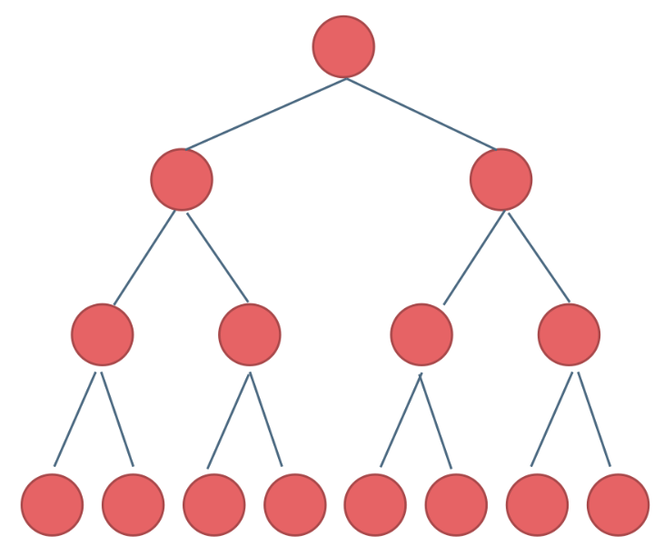
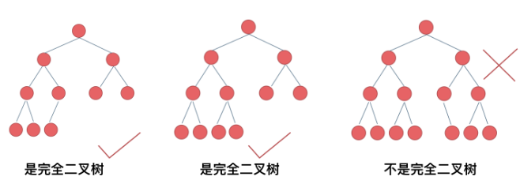
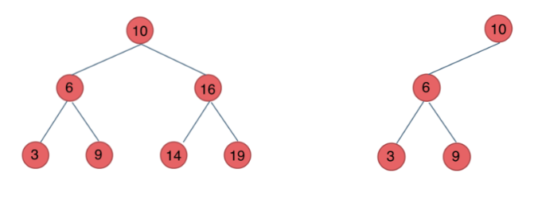

# 二叉树

## 满二叉树
**什么样的二叉树是满二叉树呢？**  
如果一棵树上只有度为2和度为0的节点，而且度为0的节点在同一层上，这样的一棵树就是满二叉树。一颗深度为$k$的满二叉树，节点数目为$2^{k}-1$。$k$从1开始。
<div align=center></div>

## 完全二叉树
**什么样的二叉树是满二叉树呢？**  
如果一棵树，除了最底层的节点没有填满，其余每层节点都达到最大值，并且最下面一层的节点都集中在最左边。若一颗完全二叉树的深度为$k$，则第$k$层的节点数应为$1-2^{k-1}$个。 

<div align=center> </div>

## 二叉搜索树（二叉排序树）
**什么是二叉搜索树**
二叉搜索树的节点是有值的，二叉搜索树是一个有序树。
* 若左子树不为空，则左子树上的所有节点的值都小于它的根节点的值
* 若右子树不为空，则左子树上的所有节点的值都大于它的根节点的值
* 二叉搜索树的左右子树也是二叉搜索树
<div align=center></div>

## 平衡二叉树
平衡二叉树是一种特殊的二叉搜索树。**它是一棵空树或它的左右两个子树的高度差的绝对值不超过1，并且左右两个子树都是一棵平衡二叉树。**

<div align=center> </div>
C++中map、set、multimap，multiset的底层实现都是平衡二叉搜索树，所以map、set的增删操作时间时间复杂度是logn，注意我这里没有说unordered_map、unordered_set，unordered_map、unordered_set底层实现是哈希表。

## 二叉树的存储
二叉树可以链式存储也可以顺序存储。一般用链式存储，但是数组也可以存储二叉树。

## 二叉树的遍历
* 深度优先（前序，中序，后序）
* 广度优先（层次）

## 二叉树的结构定义
```c++
struct TreeNode{
    int val;
    TreeNode* left;
    TreeNode* right;
    TreeNode(int x): val(x), left(NULL), right(NULL);
}
